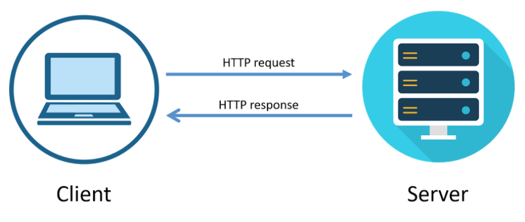
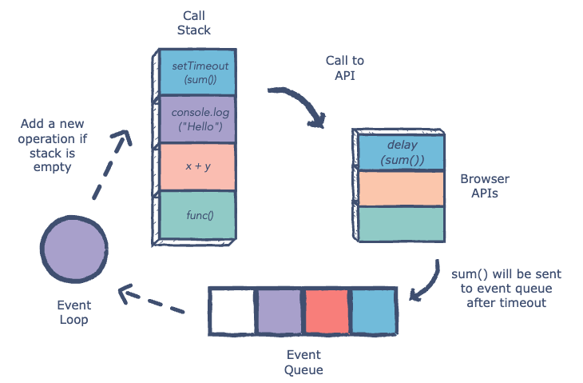
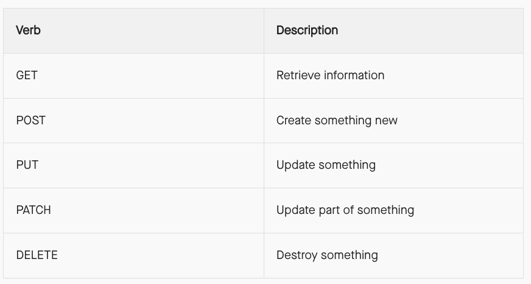
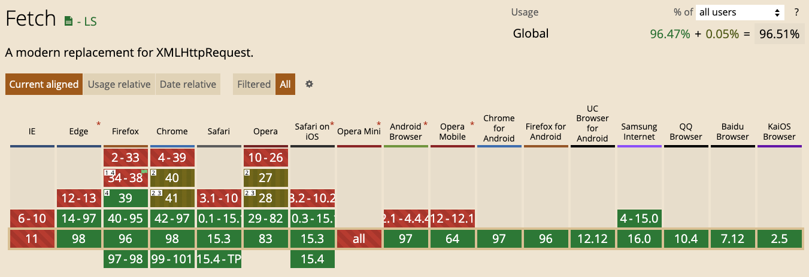

## Architecture of web apps: Clients and Servers

When you open a web page or app, it opens with text, a background, and a set of images. You click a button, and the page changes. The original text is replaced, new images are displayed. Your browser is referred to in web development as the client (or “frontend”) – a web-accessing device or software.

Servers expose resources to clients. Those resources could be HTML, CSS, JavaScript, images or data, etc. Sometimes those resources are stored on the server itself; other times, the server might provide a path from a database hosted on a different server to the requesting client. Servers make it possible for clients to get the data and other resources they need in order to do something valuable for an end user.

Browsers aren't the only type of client, however.  There are command line clients like curl, special purpose clients like Postman, and apps on your smartphone that request data from web servers. 

### Request-Response Cycle

When to request a url from a web address, lots of things happen behind the scenes in
a certain order:

1. The browser parses the URL
2. The browser sends the domain name to the ISP
3. The ISP finds the IP and sends it back to the browser
4. The browser opens a connection to the server located at the IP address
5. The browser sends a request to the server
6. The server sends a response
7. Repeat steps 6 and 7 until the browser has all of the resources it needs




## Concurrent Tasks in JavaScript (faking concurrency with asynchronous)

A program is “concurrent” when it manages multiple activities with overlapping timelines. Concurrent programs in Java or C++ use multiple threads of execution. When a processor has more than one core, these threads truly run in parallel. But there is a problem programmers must be careful to protect data, so that there is no corruption when a value is updated by different threads at the same time.

In contrast, a JavaScript program runs in a <strong>single</strong> thread. 

In particular, once a function starts, it will run to completion before any other part of your program starts running. You know that no other code will corrupt the data that your function uses. 

The problem with having a single thread is obvious: If a program needs to wait for something to happen—most commonly, for data across the internet cannot do anything else. Therefore, time-consuming operations in JavaScript are always ```asynchronous```.

You specify what you want, and provide <strong>callback functions</strong> that are invoked when data is available or when an error has occurred. The current function continues execution so that other work can be done.

This "faking" is made possible with the event loop. When asynchronous operations are interpreted, they are not executed immediately. They are placed into an ```event queue``` and executed later. Those operations will be run as soon as they can (after the synchronous code has been run). 



## AJAX

Let's take a step into a time machine. The year is 2005. 🕔🚀🕤

Wouldn't it be nice if page refreshes didn't exist? What if we could do
multiple things at once from a single web page? 

In a perfect world we could type into a search textbox and have searches performed in the background as we type. That world is here, and it's called Ajax! <a href="https://developer.mozilla.org/en-US/docs/Web/Guide/AJAX">Asynchronous JavaScript and XML (Ajax)<a/> is a technique that is used in web applications. It provides a way to retrieve content from a server and display it without having to refresh the entire page.

In the background, requests are made to a web API using JavaScript. As developers we can then choose to alter the displayed HTML based on the responses from the web API. 

And the new era in the web was born called <a href="https://en.wikipedia.org/wiki/Web_2.0">Web 2.0</a>.  

Typically, AJAX requests are made to web-based APIs, or application programming interfaces. In general, an API is a specification allowing two systems to communicate. In the context of the web, it is a bunch of functions that perform CRUD operations to data (retuirn JSON).

<strong>Note:</strong> The term AJAX was coined by <a href="ajax.pdf">Jesse James Garrett</a> back in 2005 when he founded the design firm Adaptive Path (aquired by Capital One in 2014).

### Twitter Infinite Scroll 

After you log in, Twitter sends back an HTML file that contains an initial batch of tweets, along with references to other resources the page requires (CSS, JavaScript, and image files). By the time you're scrolling through the timeline, typically the page will have fully loaded, and the JavaScript application layer will be running. That application can detect when you're nearing the bottom of the timeline, and when it sees this happen, it makes a request to the Twitter API for more tweets to display. 

The server responds with JSON data representing additional tweets. The application then inserts the data from these tweets at the bottom of the page, typically before you've reached the bottom. From the standpoint of the end user, there's an unending stream of tweets to read as they scroll down. But behind the scenes, the app is making an asynchronous request for more data and inserting that data into the DOM as it becomes available.

### Anatomy of Request and Response Messages

In the client-server model, web clients make requests to servers, which send back responses, which the client then consumes. These requests and responses are also referred to as HTTP messages. HTTP being a set of rules governing how clients and servers interact.

These rules require request and response messages to be structured in a specific way:


HTTP messages are broken up into 4 parts:

1. start-line: a high-level description of the message
2. HTTP headers: details describing the message
3. empty line: space to separate the meta-data from the body of the message
4. body: the data included in the message

### Request Messages

GET tells the server what the request is trying to do - get a resource. The start-line in our example tells the server, “I want to get the resource at /,” and that / is the website’s homepage or root. GET is one of several HTTP methods that describe what a request is trying to do. 



These are known as “CRUD operations.” When folks refer to a CRUD app, they mean one that can create, read, update, and delete resources.

These 4 are not the only <a href="https://developer.mozilla.org/en-US/docs/Web/HTTP/Methods">HTTP methods</a>, but they’re the most important ones for you to know about right now.

### Response Messages

 The start-line in the response says HTTP/1.1 200. The first half of this line (HTTP/1.1) tells the client that the response follows HTTP rules, version 1.1. The second half (200) is the HTTP status code, which tells us the status of our request. The 200 code in this example tells us that the request was successful. Not all requests succeed though, and the status codes can help us understand what went wrong.

There are many different <a href="https://developer.mozilla.org/en-US/docs/Web/HTTP/Status">response status codes</a>, but here are a few of the most common:

- 200 OK - The request succeeded
- 201 Created - The request succeeded and a resource was created
- 401 Unauthorized - The request requires authentication
- 404 Not Found - The server has not found any resource matching the request URL
- 500 Internal Server Error - The server encountered an unexpected condition that prevented it from fulfilling the request

### AJAX Dependencies

AJAX relies on several technologies:

- XMLHttpRequestObjects (XHR) - deprecated
- A serialization format called JSON
- Asynchronous Input / Output
- Promises or Callbacks 
- The event loop

### JavaScript XHR

The <a href="https://developer.mozilla.org/en-US/docs/Web/API/XMLHttpRequest">XMLHttpRequest</a> object, or XHR, was the <strong>first</strong> JavaScript API to allow transfer of data between a client and a server in the browser. 

XMLHttpRequest was named at a time when XML was all the rage, but it can be used
with any type of data, including JSON, which is the current de facto standard.

> **Definition:** JSON stands for JavaScript Object Notation. Browsers and
> servers are only able pass strings of text to each other. By using JavaScript
> Object Notation, we can structure this text in a way that a browser or server
> can read as a regular JavaScript object.

### Using XHR to make an AJAX Call

```HTML
  <body>
    <div class="result"></div>
  </body>
```
```JS
let xhr = new XMLHttpRequest();
xhr.onreadystatechange = function() {
    if (xhr.readyState === 4){
        document.querySelector('.result').innerHTML = xhr.responseText;
    }
};
xhr.open('GET', 'https://jsonplaceholder.typicode.com/posts/1');
xhr.send();
```

In examining this code we see that the `onreadystatechange` event handler is called
whenever the `readyState` attribute changes. The event handler requires a `callback` function to be executed whenever the `readyState` changes.

This was the earliest code to perform AJAX requests. It was deprecated many, many years ago but the XMLHttpRequest API has been supported in the earliest of browsers and is still today.

### Using the Fetch API

The ```fetch()``` function is the standard API for fetching resources. It's a global function, which means no creating new XHR objects or using outdated libraries like jQuery, and it vastly streamlines simple resource requests. 

```JS
fetch('https://api.github.com/repos/jquery/jquery/commits')
  .then(res => res.json())
  .then(json => console.log(json));
```



### Promises and then

In JavaScript, a ```Promise``` object represents a value that may not be available yet, but will be resolved at some point in the future. Essentially, the promise is an object that represents the result of an operation, whenever it occurs. This allows us to write more flexible asynchronous code than simply passing callback functions to asynchronous functions.

All promises implement a ```then``` function that is called when the promise is fulfilled, or completed successfully. So this is very similar to the idea of a callback on success that we'd use with XMLHttpRequest or $.ajax.

So in this code:

```
fetch('https://api.github.com/repos/jquery/jquery/commits')
  .then(res => res.json())
  .then(json => console.log(json));
```

the line ```then(res => res.json())``` is getting the response ```res``` from fetch and using the json method  to turn it into JSON. Then it's passing the JSON to the next line, ```then(json => console.log(json))```, to be handled by that function.

#### res.json()

The fetch API includes a mixin, or additional code, called <a href="https://developer.mozilla.org/en-US/docs/Web/API/Fetch_API/Using_Fetch#body">Body</a>, which has functions that specialize in transforming the body of a request or response.

Calling ```res.json()``` in our fetch is just a nice shorthand for saying "give me the body of the response parsed as JSON".

## Additional Resources

  - [AJAX Overview - MDN (ignore implementation details)](https://developer.mozilla.org/en-US/docs/Web/Guide/AJAX)
  - [JS  event loop](https://www.youtube.com/watch?v=8aGhZQkoFbQ)
  - [Another JS event loop resource](https://www.youtube.com/watch?v=WvTMIKHvPxU)
  - [HTTP Crash Course - Traversy Media](https://www.youtube.com/watch?v=iYM2zFP3Zn0)
  - [Fetch API - MDN](https://developer.mozilla.org/en-US/docs/Web/API/Fetch_API)
  - [Using Fetch API Tutorial](https://www.youtube.com/watch?v=cuEtnrL9-H0)
  - [Promise object - MDN](https://developer.mozilla.org/en-US/docs/Web/JavaScript/Reference/Global_Objects/Promise)
  - [Async Crash Course - Traversy Media](https://www.youtube.com/watch?v=PoRJizFvM7s)
  - [Asynchronous Playlist - Net Ninja](https://www.youtube.com/watch?v=ZcQyJ-gxke0&list=PL4cUxeGkcC9jx2TTZk3IGWKSbtugYdrlu)