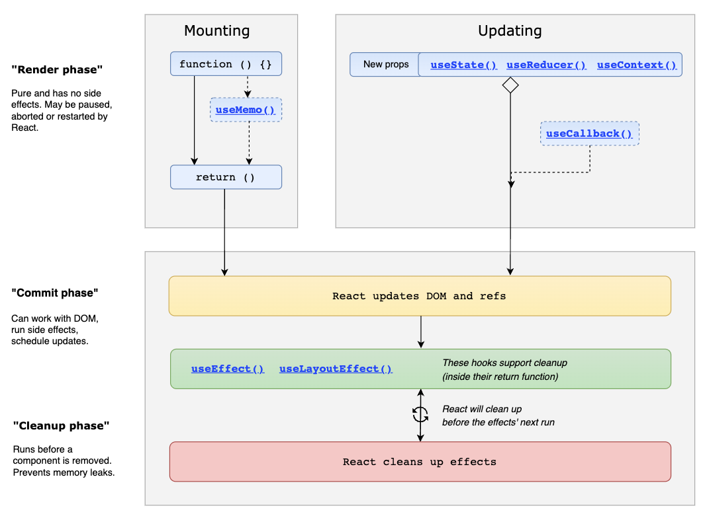

## Component Life Cycle Methods

When writing React components, we need access to lifecycle events to handle a variety of side effects: 
fetching data on mount, sanitizing props when the component updates, cleaning up before the component unmounts, etc.

Before in the integration of hooks, handling lifecycle events required `ES6 class-based components`. 
Class components gave React developers access to the most common lifecycle methods: componentDidMount, componentDidUpdate, and componentWillUnmount.
These 'lifecycle' methods were only available in `class components`.

Starting with <strong>React version 16.8</strong> hooks were added</a> that replaces the class lifecycle methods. 🤓

## React Lifecycle using Hooks



You can take advantage of the ```useEffect hook``` to achieve the same results as with the componentDidMount, componentDidUpdate and componentWillUnmount methods. 

useEffect accepts two parameters. The first one is a callback which runs after render, much like in componentDidMount. The second parameter is the effect dependency array. If you want to run it on mount and unmount only, pass an empty array [].

### useEffect hook

The `useEffect` hook allows injection of code at the end of the `mounting stage` where the component just rendered to the DOM. It also can be run whenever state changes and forces the component to the `updating` stage and re-renders to the DOM.

So you can say `loosely` that useEffect hook has the same functionality as the lifecycle method of componentDidMount() and componentDidUpdate().

<a href="https://en.wikipedia.org/wiki/Side_effect_(computer_science)">Side effect</a> (often simply called effect) isn't a term that's specific to React. It's a general concept about the behavior of a function. 

For example, a function that modifies a DOM element is introducing a side effect; the DOM element doesn't belong to the scope of the current function. If you aren't using React to update the state or render HTML, that's a side effect. Basically, it's any non-React thing.

The useEffect hook lets you perform side effects in functional components. It performs an action once the page loads for the first time (e.g. fetching requests). 

The useEffect() hook accepts two arguments:

 - A function to run the effect
 - An optional array of dependencies for the effect function. These values determine when to rerun the effect.

After each rendering—and after updating the DOM—React invokes the function passed to useEffect().

```JS
import React, {useEffect} from 'react';

useEffect(() => {
    // put your code here
  }, dependencies)
```

#### When is the effect rerun?

The optional second parameter to useEffect() — the array of dependencies for the effect function — controls when the effect reruns. React has three different options for when the effect is rerun, and you'll learn about all three of these options next.

 - By default, useEffect() runs after the first render and after every change to props or state.
 - Run the effect once (adding [] as a dependency)
 - Run the effect when a value changes (add state variable in [state variable])

Here is an example of using useEffect to make an API call:

```JS

const [user, setUser] = useState({});

useEffect(() => {
    async function loadUsers() {
      const response = await fetch(
        "https://jsonplaceholder.typicode.com/users/1"
      );
      const userFromAPI = await response.json();
      setUser(userFromAPI);
    }
    loadUsers();
  }, []); // Passing [] so that it only runs the effect once

  if (user.id) {
    // conditionally render after useEffect completes:
    return (
       ...
    );
  }
});
```

#### Why is useEffect() needed for API calls?

You might be wondering why you can't call fetch() directly rather than wrapping it in useEffect()?

Consider what would happen if you didn't use useEffect(). 

The component would be rendered, triggering a call to fetch(), which would eventually call setUser() and update the state. Every call to update the state would trigger a re-render. The re-render would trigger another call to fetch(), and so on. The code would then be stuck in an infinite re-rendering loop. The same thing will happen if you omit the empty array as the second parameter.

### Conditional Rendering

Conditional rendering is a term to describe the ability to render different user interface (UI) markup if a condition is true or false. In React, it allows us to render different elements or components based on a condition.

This concept is applied often in the following scenarios:

 - Rendering external data from an API.
 - Showing or hiding elements.
 - Toggling application functionality.
 - Implementing permission levels.
 - Handling authentication and authorization.

 You can use JavaScript operators like `if` or the `conditional (ternary) operator` to create elements representing the current state, and let React update the UI to match them.

```JS
function Greeting(props) {
  const isLoggedIn = props.isLoggedIn;
  if (isLoggedIn) {
    return <UserGreeting />;
  }
  return <GuestGreeting />;
}

function Mailbox(props) {
  return (
    <div>
      {unreadMessages.length > 0 &&
        <h2>
          You have {unreadMessages.length} unread messages.
        </h2>
      }
    </div>
  );
}

function Login(props) {
  return (
    <div>
      {props.isLoggedIn
        ? <LogoutButton onClick={handleLogoutClick} />
        : <LoginButton onClick={handleLoginClick} />
      }
    </div>
  );
}
```

