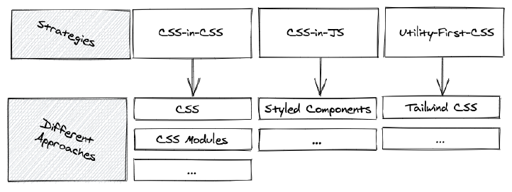

## Client-Side Routing

React Router enables "client side routing".

In traditional websites, the browser requests a document from a web server, downloads and evaluates CSS and
JavaScript assets, and renders the HTML sent from the server. When the user clicks a link, it starts the
process all over again for a new page.

Client side routing allows your app to update the URL from a link click without making another request
for another document from the server. Instead, your app can immediately render some new UI and make data
requests with fetch to update the page with new information.

This enables faster user experiences because the browser doesn't need to request an entirely new document
or re-evaluate CSS and JavaScript assets for the next page. It also enables more dynamic user experiences
with things like animation.

```jsx
import * as React from "react";
import { createRoot } from "react-dom/client";
import {
  createBrowserRouter,
  RouterProvider,
  Route,
  Link,
} from "react-router-dom";

const router = createBrowserRouter([
  {
    path: "/",
    element: (
      <div>
        <h1>Hello World</h1>
        <Link to="about">About Us</Link>
      </div>
    ),
  },
  {
    path: "about",
    element: <div>About</div>,
  },
]);

createRoot(document.getElementById("root")).render(
  <RouterProvider router={router} />
);
```

## Styling

There are many ways (aka methodologies) to style a React application.



### Modern Component Architecture

There are a few “hard problems” when it comes to CSS. One of the very hardest has to do with CSS global nature: how do we structure large applications to avoid specificity wars and naming collisions? How do we identify which styles affect a given element?

### CSS Stylesheets 

Writing CSS in a stylesheet is probably the most common and basic approach to styling a React application.

Plain CSS (CSS in CSS) would be accomplished by either having a global CSS file (App.css) and having all of your styles in that one file OR creating separate .css file per component. 

> The problem with creating a separate .css file per component is possible name conflicts and specificity issues. 

```CSS
/* global.css */

.button {
  width: 200px;
  border: none;
  background-color: aqua;
}
```

```JS
import "./global.css";

export default function App() {
  return (
    <>
      <button className="button">I am a button</button>
    </>
  );
}
```
### Inline Styling

Inline styling works the same for HTML documents as it does for React. The difference is that you need to create an object to pass the CSS properties that you want.

The properties in the ```styles``` object must be camelCase style because kebab-case doesn't fit because of syntax rule. - is not allowed in identifier.


```JS
const styles = {
  width: 200px,
  border: none,
  backgroundColor: blue
};

const Button = () => (
  <button style={styles}>This is a button</button
)
```

> Some of the drawbacks of inline-styling in React is the complexity for adding pseudo-selectors (e.g. :hover), inability to pass props, non-support of media queries, 

### CSS Modules

<a href="https://developer.adobe.com/commerce/pwa-studio/guides/general-concepts/css-modules/
">CSS Modules</a> are .css files in which all class names are scoped locally by default.

CSS Modules are not part of the CSS Spec or browser API. It is part of the build process of webpack or other module bundlers (Parcel, Vite, etc). 

CSS modules give you the ability to control your element styles in a more granular way. They allow you to build different layers of styles while building your application using a modular approach. 

A CSS Module is simply a .css file, where classes act similarly to local variables in Javascript. 

The build tools (Create-React-App) transforms your class names into variables that are exported separately as ```named exports``` and as an ```object```. Another CSS file gets generated and then mapped to the associated const . As a result, your CSS is specifically scoped to the space it is used.

> By default CSS Modules are scoped only to classes. This means that #id and global selectors are not processed by CSS Modules. However, descendants of classes are scoped. For example, .container img will be scoped by CSS Modules but img on its own will not.

<strong>Naming</strong>

CSS Modules naming convention <a href="https://github.com/css-modules/css-modules#naming">recommends camelCasing</a>, and not using dashes or underscores in the CSS class selector names. This following JavaScript naming conventions for class member naming.

You can either:

 - Use dashes or underscores in CSS selector names, but in JSX use brackets `[]` wrapped around the name prefaced by the object referencing the .css file.
 - Use camelCasing for your CSS selector names in your .css file.

 ```JS
// Movie.module.css: 
.movie-list {

// Movie.jsx: 
import style from './Movies.module.css';

<div className=style['movie-list']>{movie}</div>
 ```

Reference: <a href="https://github.com/css-modules/css-modules#naming">https://github.com/css-modules/css-modules#naming</a>


```CSS
/* Button.module.css  */

.button {
  width: 200px;
  border: none;
  background-color: blue;
}
```

```JS
/* Button.jsx */

import styles from "./Button.module.css";

const Button = () => {
  return <button className={styles.button}>This is a button</button>;
};

export default Button;
```

```JS
import "./Button.jsx"

export default function App() {
  return (
    <>
      <Button>I am a button</button>
    </>
  );
}
```

### CSS-in-JS

There are a few popular libraries to do CSS-in-JS such as <a href="https://styled-components.com/">styled components</a>, and <a href="https://emotion.sh/docs/styled">Emotion</a>. CSS-in-JS is not a specific library, it’s a concept that tries to solve the problem of styling in React applications.

Styled-components are designed to eliminate the mapping between components and styles, so when you’re defining your styles, you’re really just building a regular React component with your styles attached.

 styled-components use <a href="https://developer.mozilla.org/en-US/docs/Web/JavaScript/Reference/Template_literals#tagged_templates">tagged template literals</a> in JavaScript to style components. Tagged template literals allows you to parse template literals with a function. It is powered by tagged templates and allows to create normal React components by only defining styles.

<strong>Install the Styled Components package:</strong>

```
npm i styled-components
```

<strong>Import into component</strong>

```JS
import styled from "styled-components";
```

<strong>Create style object and use inline</strong>

```JS
const StyledButton = styled.button`
   width: 200px;
   border: none;
   background-color: grey;
`;

const Button = () => {

  return <StyledButton>This is a button</StyledButton>;
}
```

Here, ```StyledButton``` is the styled component, and it will be rendered as an HTML button with the contained styles. ```styled``` is an <a href="https://styled-components.com/docs/api#styled">internal utility method</a> that transforms the styling from JavaScript into actual CSS.

> The only issue against CSS-in-JS libraries involves performance. These libraries do some relatively heavy lifting under the hood: compiling and interpolating props for styling directives in tagged template literals, building a graph of managed elements, preprocessing CSS, and injecting the CSS into the page. So for large-scale React applications, it could be an issue, but generally the performance hit should be minimal.