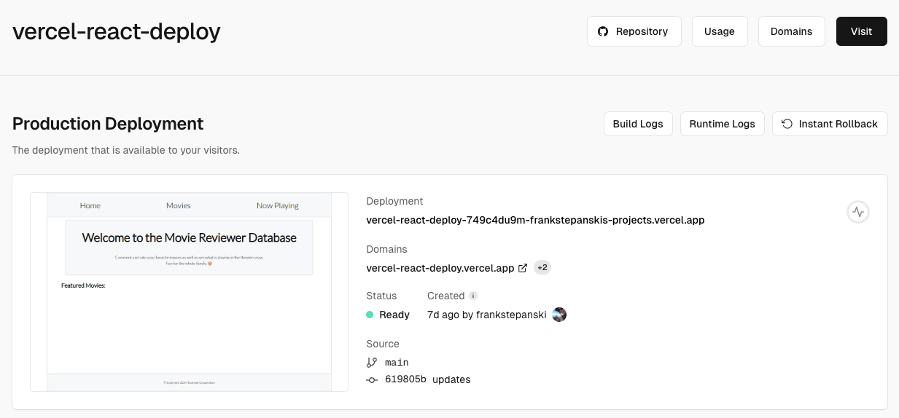

## Deployment

Deployment is the process of making an application or system available for use in a specific environment, 
such as production, staging, or development. 

The deployment process involves various stages, from preparing the application to be deployed, 
transferring it to the target environment, configuring the environment, 
and finally making it available to end-users. 

Effective deployment ensures that the application runs efficiently, securely, and with minimal downtime.

### Key Steps in the Deployment Process

- **Build:** Create a production build using your chosen build tool. 
This process typically involves running a command that optimizes your app for performance by minifying 
JavaScript files, optimizing images, and removing unnecessary.

- **Output:** The output is usually a folder (often named dist or build) containing static files.

- **Deploy:** Transfer the production build to the target environment.
This could involve copying the files to a web server, cloud storage, or a content delivery network (CDN).

- **Upload:** Use the platform's UI, CLI, or integrate with a Git repository to deploy the build folder.

- **Configure:** Set up any necessary configurations, such as environment variables, routing rules, or security settings.

### Deployment Platforms

There are many platforms available for deploying web applications, each with its own features and pricing models.

- **Vercel:** Vercel is a platform for deploying web applications with a focus on serverless functions and Jamstack architecture.

- **Netlify:** Netlify is another popular platform for deploying web applications, offering features like continuous deployment, serverless functions, and form handling.

- **Heroku:** Heroku is a cloud platform that supports multiple programming languages and frameworks, making it a versatile choice for deploying web applications.

- **AWS:** Amazon Web Services (AWS) provides a wide range of services for deploying web applications, including EC2 for virtual servers, S3 for storage, and Lambda for serverless functions.

- **Google Cloud Platform:** Google Cloud Platform offers services like App Engine for deploying web applications, Cloud Storage for storage, and Cloud Functions for serverless functions.

### Deployment Tools

- **CLI:** Many deployment platforms provide a CLI (Command Line Interface) tool for deploying applications from the command line.

- **Git Integration:** Some platforms allow you to deploy applications directly from a Git repository, making it easy to automate the deployment process.

- **Continuous Deployment:** Continuous Deployment tools like GitHub Actions, CircleCI, or Travis CI can automate the deployment process whenever changes are pushed to a repository.

### Deployment to Vercel

[Vercel](https://vercel.com/) is a platform for deploying web applications with a focus on serverless functions and Jamstack architecture.

To deploy a React application to Vercel, follow these steps:

1. Install the Vercel CLI:

```bash 
npm install -g vercel
```

Build your React application:

```bash
npm run build
```

Deploy your React application to Vercel:

```bash
vercel --prod
```

Follow the prompts to log in to your Vercel account and deploy your application.

Once the deployment is complete, you will receive a URL where your application is hosted.

2. Deploying with Vercel GitHub Integration

Vercel provides GitHub integration, allowing you to deploy your application automatically whenever you push changes to a GitHub repository.

To set up GitHub integration with Vercel:

1. Install the Vercel for GitHub app on GitHub.

2. Connect your GitHub account to Vercel.

3. Import your React application repository to Vercel.

4. Configure the deployment settings, such as the branch to deploy from and the build command.

5. Push changes to your GitHub repository to trigger automatic deployments.

Vercel will build and deploy your application whenever you push changes to the specified branch.

### Example Deployment



[Movie Review App](https://vercel-react-deploy.vercel.app/)

