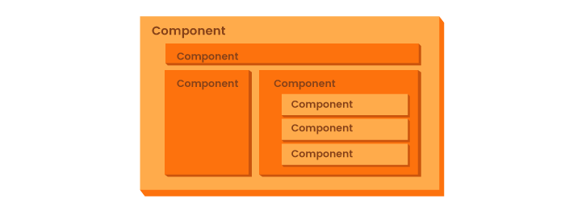
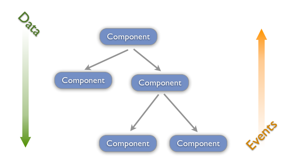

## What Is React?

React is a Javascript library that was created and is maintained by Facebook. React is used to manage the DOM and create highly performant user interfaces and front end applications.

Some popular websites that use React are:

- Instagram

- Netflix

- Imgur

- Tesla

- Venmo

## Why Use React?

React makes front end Javascript development much easier.

Uses JSX.

Virtual DOM.

Utilizes something called `components` that are self contained pieces of the application.

These components make up the `component based architecture` for our application

## Component Based Architecture

Component based architecture is where an application uses components to make up each part of our application. This creates organization in our code and an understanding on how to layout our components in our application.



## Virtual DOM

The `Virtual DOM` is a light-weight copy of the actual DOM. The Virtual DOM is the representation we will be using to update our user interface in React. Anytime there is a change to the Virtual DOM, it will go through a process called `reconciliation`. This is where it compares itself to the actual DOM to see if there has been any changes, and if there has been then it will update the actual DOM only at the part that needs to be updated.


## Components

Components are the building blocks of a React application.

A component is either a class or a function that will return a React element that will describe how a section of the user interface will be displayed and interacted with.

> Note: it's important to keep in mind that components need to start with an uppercase letter

### Functional Component

A functional component is a simple component or sometimes referred to as a `dumb component`. That is because a functional component cannot hold any local state values to it, it's meant to just receive data and return a React element.

```javascript
import React from 'react'

const DumbComponent = () => <h1>Hello, I'm a functional component</h1>

export default DumbComponent
```
### JSX

The tag syntax inside of a component is not a string or HTML. It's called `JSX`, which is a syntax extension to Javascript. JSX produces React "elements" that describe how the user interface should appear for that React element. This looks very familiar to HTML, so if you are comfortable with that, then it should be easy to get the hang of.

```jsx
<div>
  <h1>This is JSX</h1>
  <p>
    It looks very similar to HTML, but it is not HTML. It is an extension of
    Javascript that helps us create the UI of a component
  </p>
</div>
```

### Data In React

React will handle its data using a `unidirectional data flow`. This means that data is passed down from the top of the application to the bottom. We can determine what top and bottom are using our `component architecture design`.

We can use events to send data back up the `component tree`.



Data can be passed as `props` from a parent component to a child component


Here are some resources on getting started with React:

- [React Roadmap](https://roadmap.sh/react)
- [High Level Overview of React](https://www.youtube.com/watch?v=FRjlF74_EZk&t=40s)
- [What Create React App Really Does](https://www.freecodecamp.org/news/create-react-app-npm-scripts-explained/)
- [Component Composition](https://www.youtube.com/watch?v=IDDIvXqMiD4&t=69s)
- [Steve Griffith Playlist](https://www.youtube.com/playlist?list=PLyuRouwmQCjmMfs-HOsDGoaN6JiYrC6Ms) 
- [Free Scrimba React Course](https://scrimba.com/learn/learnreact)
- [Let's Learn React - Learn with Jason Video Podcast](https://www.learnwithjason.dev/let-s-learn-react)
- [Free Mini React Course](https://fullstackopen.com/en/part1)
- [Watch some crazy dudes code for 20 hours](https://www.youtube.com/watch?v=0mVbNp1ol_w&t=18382s)

### React Under-the-Hood

A lot happens to make React work. If you are curious, here are some technical resources:

- [React Deep Dive - Phillp Fabianek](https://www.youtube.com/watch?v=7YhdqIR2Yzo)
- [React Fiber Overview - React's main algorithm](https://www.youtube.com/watch?v=ZCuYPiUIONs&t=28s)
- [React Fiber Overview Article](https://github.com/acdlite/react-fiber-architecture)
- [React Fiber Deep Dive](https://www.youtube.com/watch?v=0ympFIwQFJw)
- [React Fiber Article](https://blog.logrocket.com/deep-dive-react-fiber/)
- [React Theoretical Concepts](https://github.com/reactjs/react-basic)