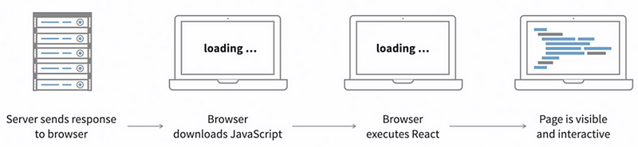
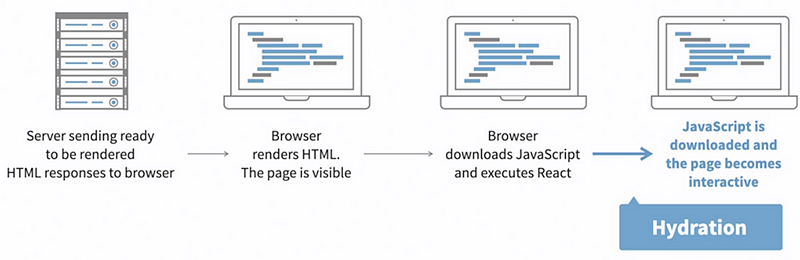

This is a [Next.js](https://nextjs.org/) project bootstrapped with [`create-next-app`](https://github.com/vercel/next.js/tree/canary/packages/create-next-app).

### Next.js

Next.js can be thought of a full-stack environment to build React applications within.

React creates a SPA (Single Page Application) which renders on the client side. 

Which is when the JavaScript app launches from a web page and then runs entirely in the browser. 
All visual changes on the website happen as a reaction to user actions and the data received from
the remote APIs.

It is called single-page because the server does not render pages for the client; 
it always delivers the same minimalistic markup required to bootstrap the JS app. 
All page rendering and navigation happen purely on the client, using JavaScript.

The advantages that this approach gives are that the client can run something in the background
between page transitions, and the client does not have to re-download and re-render
the entire page to swap only the main content.

Unfortunately, it also brings drawbacks, because now the client is responsible for all state changes.
For the synchronization of such changes across the entire interface, it must know when to load
the data and what particular data.

### React Performance issues

To start, single-page apps (SPA) have to download lots of assets to the client: 
JS files with the app itself, CSS files with styles, images, media, and so on. 

It is impossible to develop a large-scale JS app without any kind of modularization, 
so most JS apps consist of numerous small JS files. 

The nature of SPAs forces them to have heavy API traffic. Any user action that has
to be persisted requires an API call. Pulling data from persistent storage also
requires API calls (i.e. database).

So how do we deal with this?
A solution is available called <strong>server-side rendering (SSR).</strong>

### Server-side rendering (SSR)

To more efficiently load the initial data for a JS app, we can utilize the server-generated approach. 

We can render the initial markup on the server and then let the JS app take it over later.
The server can optimize rendering time by caching the results from rendering individual components or entire pages, 
indexed on a serialization of the parameters that affect the output that is used by the component.

This is particularly true of components or entire pages that will be viewed repeatedly in the same state.

Resources:
- <a href="https://www.youtube.com/watch?v=Sklc_fQBmcs">Overview</a> 
- <a href="https://www.youtube.com/watch?v=d2yNsZd5PMs">How Next.js Works Behind-the-Scenes</a> 
- <a href="https://nextjs.org/learn/react-foundations/what-is-react-and-nextjs">Mini Course from Official Next.js site </a> 
