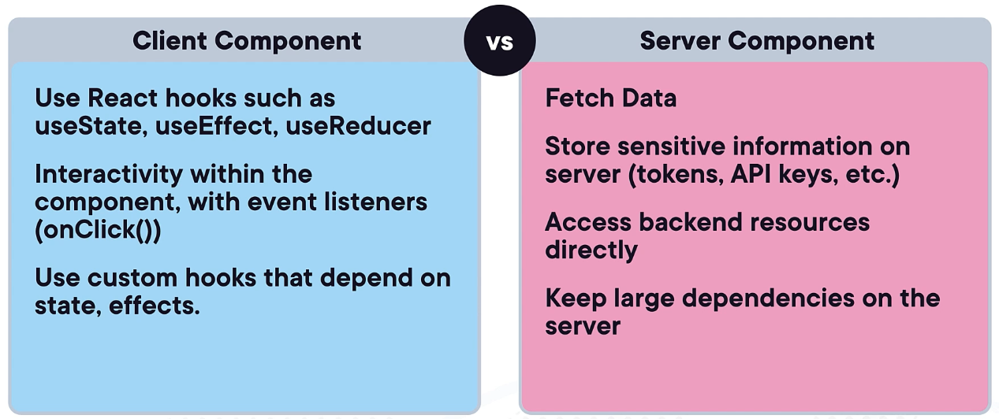

## Next.js 

Next.js is a flexible React framework that gives you building blocks to create fast web
full-stack applications. Next.js builds on React and provides additional features and optimizations. 

You can use React to build your UI and then incrementally adopt Next.js features
to solve common application requirements such as routing, data fetching, etc.

### Major Features

- File-system based routing
- Hybrid rendering: SSR (server-side rendering), SSG (static site generation) and CSR (client-side rendering)
- Image and font optimization
- Automatic bundle-splitting and lazy-loading

Next.js is normally used to build ***fullstack*** applications. You can use Next.js to build the frontend 
and backend of your application. Next.js provides an API route feature that allows you to create API endpoints
within your Next.js application. This eliminates the need for a separate backend server 
(eg. Node + Express, Python + Flask, etc).

***Note:*** There is no requirement that you have to use Next.js for the backend. You can use any backend technology
but Next.js provides a convenient way to build fullstack applications with the stack that you are already using.

### How React does Client-side Rendering

Content is rendered in the browser by the client fetching a bundle JS file from the server.
This allows for dynamic content to interact fairly quickly with the user without having to 
send a request to the server for each interaction.

But this can be slow for the initial page load because the client has to wait for the bundle to be
fetched and rendered. For large applications, this can be a problem. The larger the application, the
longer the wait time. Even with code splitting and lazy loading, the initial load time can be slow.

### Next.js to the Rescue

Next.js provides a way to render pages on the server-side. This means that when a user requests a page,
the server will render the page and send the HTML to the client. This is useful for SEO and performance.

There still can be a bundle JS file that is sent to the client but the server-side rendering can help
reduce the initial load time. And normally the bundle JS file is smaller because the server has already
rendered the page.

The process of adding the JavaScript to the page is called ***hydration***. React will take over the page
and manage the rendering of the page from that point on. Hydration is not a Next.js feature. It was developed by the React team (as early as React 16). Next.js
just takes advantage of it from the [hydrateRoot](https://react.dev/reference/react-dom/client/hydrateRoot)
function in the react-dom package.

### Server-side Rendering (SSR)

The default behavior of Next.js is to render pages on the server-side. This means that when a user requests a page,
the server will render the page and send the HTML to the client. This is useful for SEO and performance.

#### Server Components

There are two types of **components** in Next.js:

- Client: Rendered on the server and hydrated on the client.
- Server: Rendered on the server, and no hydration on the client.

Server components can fetch data on the server and reduce the amount of JavaScript sent to the client.
No need to worry about private API keys or sensitive data being sent from the client. It is all done on the server.
Since they are not hydrated on the client, they are **not interactive**. They are just static HTML.

Both client and server components [can be used together](https://nextjs.org/docs/app/building-your-application/rendering#rendering-environments) 
in the same application as well as both being cached.

Server components allow you to render components on the server and reduce the amount of JavaScript sent to the client.

You can interweave server components with client components. React will seemlessly manage the rendering of both.

All components inside the /app directory are Server Components by default.



[Complete Checklist](https://nextjs.org/docs/app/building-your-application/rendering/composition-patterns#when-to-use-server-and-client-components)


### Client-side Rendering (CSR)

Next.js can also render pages on the client-side. This is useful for pages that change often or require user interaction.
When a user requests a page, the server will send a minimal HTML page to the client. The client will then fetch the data

To create a client component you use the 'use client' directive at the top of the file.

https://nextjs.org/docs/app/building-your-application/rendering/client-components

### Data Fetching

Data fetching can be done in Next.js on a page-by-page basis.

You can choose the data fetching strategy that best fits the specific page requirements.

#### Static Data Fetching is the default behavior in Next.js. 

  - Data is fetched at build time once and then cached. The cached data is re-used on each additional request.
  - This is useful for pages that do not change often.

#### Static Data Fetching with Revalidation

  - Data is fetched at build time and then cached. 
  - Cached data is re-used on each request until it reaches a specificed interval of time.
  - After the specified time interval, Next.js revalidates the data, and invalidates the previous cache.
  - This method is useful for pages that change often but do not require real-time data.

#### Dynamic Data Fetching (aka Server-side Rendering SSR)

  - Data is fetched on each request.
  - This method is useful for pages that require real-time data (eg. shopping cart, user dashboard, etc).
  - There is no caching of data. Performance can be slower than SSG or ISR.

### Fetching Data on the Server with fetch

Data fetching in Next.js uses the Fetch API in the /app folder.

The Fetch API works on top of the native fetch() Web API, which makes use of the async/await functions and
returns a promise. It allows caching and revalidation options within the fetch request itself. 

#### Static Data Fetching or Static Site Generation (SSG)

By default, the fetch call is set to static data fetching from the cache.

```javascript
async function fetchData() {
    const res = await fetch(
        `https://jsonplaceholder.typicode.com/posts`,
    );
    const data = await res.json();
    return data;
}
```

#### Static Data Fetching with Revalidation or Incremental Static Regeneration (ISR)

You use the [next.revalidate option](https://nextjs.org/docs/app/building-your-application/data-fetching/fetching-caching-and-revalidating#time-based-revalidation) 
of fetch to set the cache lifetime of a resource (in seconds).

```javascript
async function fetchData() {
    const res = await fetch(
        `https://jsonplaceholder.typicode.com/posts`,
        {
            next: { revalidate: 3600 }
        }
    );
    const data = await res.json();
    return data;
}
```

#### Dynamic Data Fetching or Server-side Rendering (SSR)

This request should be re-fetched on every request.

```javascript
async function fetchData() {
    const res = await fetch(
        `https://jsonplaceholder.typicode.com/posts`,
        {
            cache: 'no-store'
        }
    );
    const data = await res.json();
    return data;
}
```

### Dynamic Routes

When you don't know the exact segment name ahead of time, you can create routes for dynamic data using
[Dynamic Segments](https://nextjs.org/docs/app/building-your-application/routing/dynamic-routes).

A dynamic segment can be created by wrapping a folder's name in square brackets. For example, [id] or [slug].

```javascript
// app/conference/[id]/page.js

export default function Page({ params }) {
    return <h1>My Speaker Page</h1>
}   
```

### Generating Static Params

Is a server function that defines the list of route segment parameters. It is statically generated at build 
time instead of on-demand at request time. 

The code below is an example of a function that generates static parameters for a list of speakers.
The id parameter is used to create a dynamic route for each speaker. Which is then used to generate
a static page for each speaker.

```javascript
export aync function generateStaticParams() {
    const speakers = await getSpeakers();

    return speakers.map(speaker => ({
        params: {
            id: speaker.id
        }
    }));
```

### Setup

To create a new Next.js project, you can use the following command:

```bash
npx create-next-app my-next-app
```


